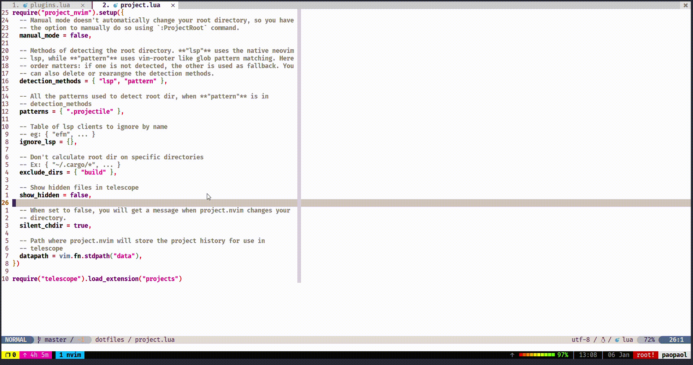

# telescope-git-diffs.nvim

[Telescope](https://github.com/nvim-telescope/telescope.nvim) picker of git diffs between commits



## Installation

Install with your favorite plugin manager and add

with packer

```bash
use {
  'paopaol/telescope-git-diffs.nvim',
   requires = {
     "nvim-lua/plenary.nvim",
     "sindrets/diffview.nvim",
   },
}
```

```lua
require('telescope').load_extension('git_diffs')
```

somewhere after loading telescope.

## Usage

The extension provides two new pickers:

```viml
:Telescope git_diffs  diff_commits
```

Lua equivalent:

```lua
require('telescope').extensions.git_diffs.diff_commits()
```
